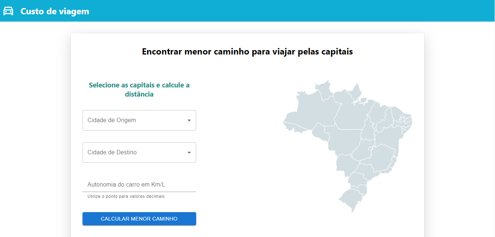
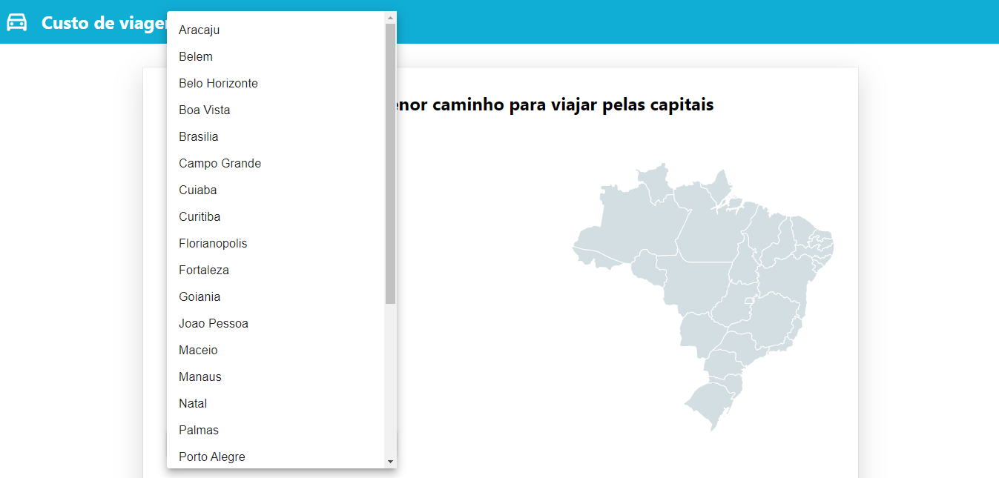
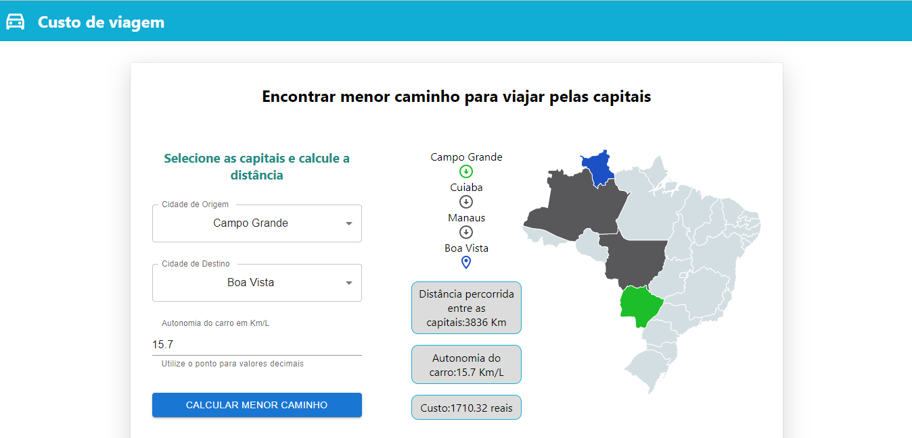

# Custo de Viagens Rodoviárias

**Número da Lista**: 2<br>
**Conteúdo da Disciplina**: Grafos 2<br>

## Alunos
|Matrícula | Aluno |
| -- | -- |
| 19/0044799  |  Antônio Ferreira de Castro Neto |
| 18/0125885  |  Lucas Melo dos Santos |

## Sobre 
O projeto consiste em um aplicação web que calcula o custo de uma viagem  de carro a gasolina e que passe por várias capitais, tendo objetivo de visita-las fazendo o menor caminho possível. Dessa forma, é utilizado o **algoritmo de Dijkstra**.

Nesse contexto, os nós são as capitais, e arestas são dadas a partir da divisa entre os estados do Brasil, já os pesos são as distâncias entre as capitais.

## Screenshots
### Tela Inicial 


### Select das capitais


### Distância mínima e custo da viagem


## Instalação 
**Linguagem**: Javascript<br>
**Framework**: React<br>


## Uso 
* Após clonar o repositório em sua máquina:

```
cd Grafos2_Custo-de-Viagens/custo_viagens

yarn

yarn start
```
ou 
```
cd Grafos2_Custo-de-Viagens/custo_viagens

npm install

npm start
```
## Outros 
Quaisquer outras informações sobre seu projeto podem ser descritas abaixo.


